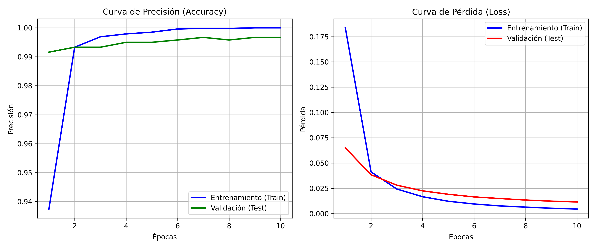

# DO YOU TENSORFLOW? — Ves lo que veo 👁️🤖
## IUJO — Feria de Haceres Período I-2026
### Unidad Curricular: INO-544 (Investigación de Operaciones)

---

## 👥 Integrantes y Roles
* **Integrante 1:** [Jhonkeiver Aquino] - [31.793.598] - *Rol: Ingeniero de Despliegue (Exportación ONNX y Pruebas)*
* **Integrante 2:** [Rainer Flores] - [28.444.181] - *Rol: Analista de Métricas y QA (Pruebas de Rendimiento y Documentación)*
* **Integrante 3:** [Ángel Morfe] - [29.504.145] - *Rol: Ingeniero de Datos (Dataset y Preprocesamiento)*
* **Integrante 4:** [Manuel Pérez] - [29.625.870] - *Rol: Arquitecto de IA (Modelado y Entrenamiento)*

---

## 🎯 1. Clase/Tema Seleccionado
* **Tema asignado:** Motos
* **Descripción del Objeto:** Para el modelo entrenado, una motocicleta se define por un conjunto de características geométricas y visuales específicas que la diferencian de otros vehículos y otros objetos. Visualmente, el modelo busca detectar la presencia de dos ruedas expuestas y alineadas, un chasis visible, un manubrio direccional en la parte superior delantera, y la ausencia de un parabrisas panorámico (siendo los carros parte de las muestras negativas en el entrenamiento). Por ultimo, la red neuronal identifica las proporción vertical y delgada del vehículo cuando se ve de frente o por detrás, contrastando la diferencia de la silueta ancha y rectangular que puede tener un carro.

---

## 📊 2. Gestión del Dataset (Ingeniería de Datos)
* **Cantidad de imágenes originales recopiladas:** 3587 imagenes en total: 600 imagenes de motos + 2987 clases negativas
* **Estrategia de Data Augmentation aplicada:**
    * *Rotación:* Valores aleatorios entre -20° y +20°
    * *Zoom:* Valores aleatorios entre 80% y 120%
    * *Cambios de Brillo:* Valores aleatorios entre 80% y 120%
    * *Otras transformaciones:* Se generó un bucle que da 5 variaciones aleatorias por imagen original aplicando volteo horizontal (Flip) para simular cambios de dirección, y traslación espacial (desplazamiento en los ejes X e Y de hasta ±22 píxeles) para garantizar que el modelo reconozca la motocicleta sin depender de que el objeto esté perfectamente centrado.
* **Total de imágenes generadas para el entrenamiento:** 5 transformaciones por 600 motos = 3000 imagenes generadas + 2987 muestras negativas = 5987 imagenes en total.
* **Resolución y formato estandarizado:** 224x224 píxeles, JPG, canales RGB (Formato Tensor: `[1, 224, 224, 3]`).

---

## 🧠 3. Arquitectura del Modelo y Entrenamiento
* **Framework utilizado:** TensorFlow/Keras
* **Descripción de la Red (CNN):** Se aplicó una estrategia de **Transfer Learning** utilizando la arquitectura **MobileNetV2** pre-entrenada con el dataset *ImageNet* de San Google como extractor de características base congelando así sus más de 2.2 millones de parámetros para evitar la alteración de los pesos originales. La red se estructuró con:
    * Una capa de entrada formal `cam_input` emparejada con un nodo de preprocesamiento matemático para normalizar píxeles en el rango [-1, 1].
    * El bloque convolucional truncado de MobileNetV2 (excluyendo su capa de salida original).
    * Una capa de reducción dimensional **GlobalAveragePooling2D** para compactar los mapas de características tridimensionales a un vector plano de 1,280 elementos.
    * Una capa de salida **Densa** (Totalmente Conectada) de 1 neurona (`confidence_score`) dedicada a resolver el problema de clasificación binaria.
* **Hiperparámetros óptimos seleccionados:**
    * *Función de pérdida (Loss):* Binary Crossentropy
    * *Optimizador:* Adam 
    * *Tasa de Aprendizaje (Learning Rate):* 0.001
    * *Épocas (Epochs):* 10
    * *Tamaño de lote (Batch Size):* 32

### 💡 Justificación Crítica (Control de Autoría)
*Explique detalladamente por qué el equipo eligió esa Tasa de Aprendizaje (Learning Rate) específica y el impacto que tuvo en las gráficas de pérdida durante el laboratorio:*
Decidimos establecer la Tasa de Aprendizaje (Learning Rate) en 0.001 impulsada por el optimizador Adam. La razón técnica de esta elección radica en nuestra arquitectura de Transfer Learning. Dado que congelamos los más de 2 millones de parámetros del bloque convolucional de MobileNetV2 y solo entrenamos nuestra capa Densa final desde cero, necesitábamos un tamaño de paso moderado. Un Learning Rate mayor habría provocado gradientes inestables (haciendo que los pesos de nuestra única neurona rebotaran sin encontrar el mínimo global de error), mientras que uno menor habría requerido demasiadas épocas, haciendo el entrenamiento ineficiente.

Impacto en las gráficas:
El éxito de este hiperparámetro se evidenció directamente en la curva de pérdida (Loss). Observamos un descenso exponencial suave y estable: nuestra pérdida de validación (val_loss) bajó rápidamente de 0.0650 en la primera época a un excelente 0.0115 en la época 10. Lo más destacable fue que la curva de validación se mantuvo siempre a la par de la curva de entrenamiento sin divergir (separarse hacia arriba), lo que nos confirmó empíricamente que la red convergió de manera óptima sin caer en Overfitting (Sobreajuste).

---

## 📈 4. Métricas de Rendimiento (Testing - 20%)
* **Precisión final (Accuracy) en la data de test:** 99.67%
* **Pérdida final (Loss) en la data de test:** 0.1115


---

## ⚙️ 5. Especificación de Exportación ONNX
El modelo se ha homologado bajo los estándares requeridos por la interfaz centralizada:
* **Nombre del archivo:** `model/nombre_equipo.onnx`
* **Tensor de Entrada (Input Shape):** `[1, 224, 224, 3]` (Tipo: `float32`)
* **Tensor de Salida (Output Shape):** `[1, 1]` (Tipo: `float32`)
* **Función de activación final:** Sigmoide (Rango de salida de 0.0 a 1.0 para conversión a porcentaje).

---

## 🚀 6. Instrucciones de Ejecución Local
Para replicar el preprocesamiento y el entrenamiento del modelo en su propia máquina, siga estos pasos:

1. **Clonar el repositorio:**
   Abra su terminal y ejecute el siguiente comando para descargar el proyecto:

   ```bash
   git clone [https://github.com/NoneDestiny/INO544-2026I-MOTOS.git](https://github.com/NoneDestiny/INO544-2026I-MOTOS.git)

2. **Instalar las dependencias:**
    Asegúrese de tener Python instalado y ejecute el siguiente comando para instalar las librerías necesarias:

    ```bash
    pip install tensorflow opencv-python matplotlib tf2onnx

3. **Ejecutar el entrenamiento (OPCIONAL)**
    Si desea volver a entrenar el modelo desde cero, navegue hasta la carpeta raíz del proyecto y ejecute:

    ```bash
    python Entrenamiento.py

---

## 💾 7. Documentación Técnica

Esta sección describe la arquitectura de software, el diseño modular y las especificaciones de ingeniería implementadas para construir el detector de motocicletas. El proyecto se ha estructurado siguiendo el principio de responsabilidad única, dividiendo el ciclo de vida de los datos y el modelo en módulos independientes y auditables.

---

### 🗺️ Mapa de la Documentación Modular (`/docs`)

Para mantener el código limpio y la documentación detallada, el manual técnico se encuentra segmentado cronológicamente dentro del directorio `docs/`. Puede consultar cada fase haciendo clic en los siguientes enlaces:

#### 📁 Fase 1: Configuración e Ingeniería de Datos
* **[00. Auditoría del Dataset Base](docs/00_auditoria.md):** Verificación automatizada de consistencia elemental (`00_auditoria_imagenes.py`), asegurando que las imágenes cumplan con las dimensiones (224 x 224), canales RGB y formato JPEG exigidos por la red.

#### 📁 Fase 2: Preprocesamiento y Aumento de Datos (Data Augmentation)
* **[01. Módulo de data](docs/01_preprocesamiento.md):** Pruebas geométricas unitarias utilizando el método `cv2.flip` de OpenCV para mitigar el sobreajuste mediante variaciones espejo en el eje Y.
* **[02. Ajuste Lumínico de Brillo y Contraste](docs/02_ajustes.md):** Modificación del espacio de píxeles mediante escalados lineales (`cv2.convertScaleAbs`), robusteciendo el modelo frente a fluctuaciones ambientales de luz.
* **[03. Transformaciones Afines Aleatorias](docs/03_aleatoriedad.md):** Inyección de variabilidad estocástica en el lienzo cartesiano mediante cálculos dinámicos de rotación, zooms y traslaciones.
* **[04. Pipeline Unificado y Procesamiento por Lotes](docs/04_procesamientos_lote.md):** Lógica del motor de producción masiva (`04_pipeline_completo.py` y `05_procesamiento_lote.py`) que combinó todas las mutaciones mediante un bucle anidado para expandir el dataset a más de 3,000 muestras.

#### 📁 Fase 3: Core de Inteligencia Artificial y Entrenamiento
* **[05. Fase 2 y 3: Configuración, Arquitectura y Entrenamiento del modelo](docs/05_entrenamiento.md):** Flujo de carga por lotes (`batch_size=32`), instanciación del modelo congelado *MobileNetV2* (Transfer Learning) y análisis de la función de pérdida por entropía cruzada binaria.
* **[06. Optimización y Exportación a Formato ONNX](docs/06_exportado_del_modelo.md):** pipeline de compilación e interoperabilidad (`exportacion_onnx.py`) para migrar la red de Keras hacia un formato universal de alto rendimiento en producción.

#### 📁 Fase 4: Evaluación e Inferencia en Producción
* **[07. Evaluación del Rendimiento Gráfico](docs/07_resultados.md):** Análisis estadístico y visual de las curvas históricas de precisión (*Accuracy*) y pérdida (*Loss*) exportadas en alta fidelidad (300 DPI).
* **[08. Fase de Despliegue e Inferencia en Tiempo Real](docs/08_despliegue.md):** Implementación del script de producción final (`prueba_camara-py`) conectado a la cámara web, encargado de la traducción BGR a RGB y del despliegue del HUD visual con los porcentajes de certeza.

#### 📁 Modo Sandbox (Entorno)
* **[09. Verificación del Entorno](docs/09_pruebas.md):** Script de diagnóstico inicial (`check_env.py`) encargado de validar la integridad de las variables de TensorFlow y auditar la disponibilidad de aceleración por hardware (CPU/GPU).
